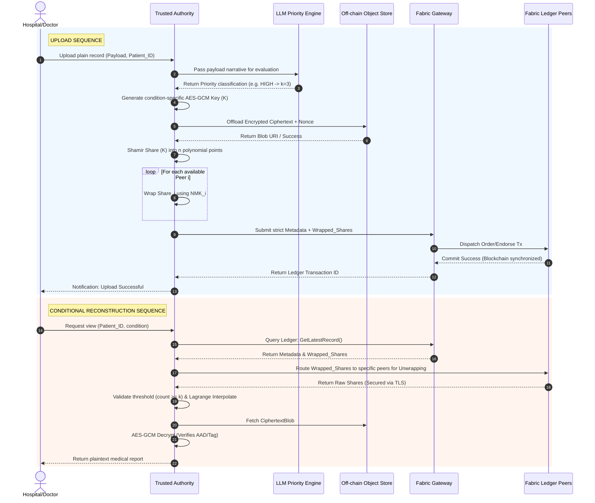

# Detailed Low-Level Architecture (Sequence Diagram)

```mermaid
sequenceDiagram
    autonumber
    actor CLI as Hospital/Doctor
    participant TA as Trusted Authority
    participant LLM as LLM Priority Engine
    participant OS as Off-chain Object Store
    participant FG as Fabric Gateway
    participant P as Fabric Ledger Peers

    %% --- UPLOAD SEQUENCE ---
    rect rgb(240, 248, 255)
        note right of CLI: UPLOAD SEQUENCE
        CLI->>TA: Upload plain record (Payload, Patient_ID)
        TA->>LLM: Pass payload narrative for evaluation
        LLM-->>TA: Return Priority classification (e.g. HIGH -> k=3)
        TA->>TA: Generate condition-specific AES-GCM Key (K)
        TA->>OS: Offload Encrypted Ciphertext + Nonce
        OS-->>TA: Return Blob URI / Success
        TA->>TA: Shamir Share (K) into n polynomial points
        
        loop For each available Peer i
            TA->>TA: Wrap Share_i using NMK_i
        end
        
        TA->>FG: Submit strict Metadata + Wrapped_Shares
        FG->>P: Dispatch Order/Endorse Tx
        P-->>FG: Commit Success (Blockchain synchronized)
        FG-->>TA: Return Ledger Transaction ID
        TA-->>CLI: Notification: Upload Successful
    end

    %% --- RECONSTRUCTION SEQUENCE ---
    rect rgb(255, 245, 238)
        note right of CLI: CONDITIONAL RECONSTRUCTION SEQUENCE
        CLI->>TA: Request view (Patient_ID, condition)
        TA->>FG: Query Ledger: GetLatestRecord()
        FG-->>TA: Return Metadata & Wrapped_Shares
        TA->>P: Route Wrapped_Shares to specific peers for Unwrapping
        P-->>TA: Return Raw Shares (Secured via TLS)
        TA->>TA: Validate threshold (count >= k) & Lagrange Interpolate
        TA->>OS: Fetch CiphertextBlob
        TA->>TA: AES-GCM Decrypt (Verifies AAD/Tag)
        TA-->>CLI: Return plaintext medical report
    end
```
