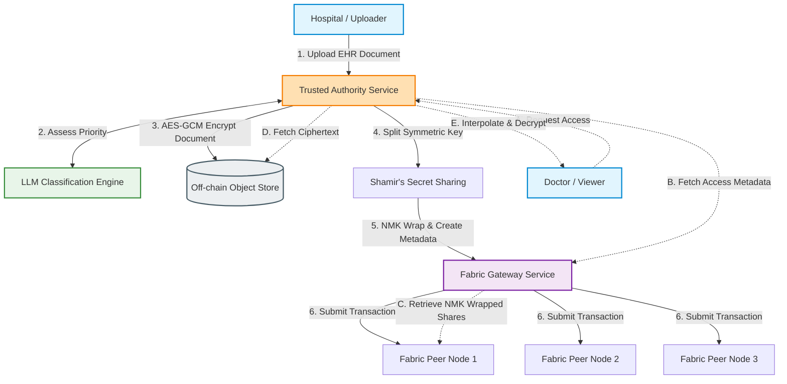

# Overall System Data Flow

```mermaid
flowchart TD
    %% Entities
    H[Hospital / Uploader]
    TA[Trusted Authority Service]
    LLM[LLM Classification Engine]
    OS[(Off-chain Object Store)]
    SSS[Shamir's Secret Sharing]
    FG[Fabric Gateway Service]
    P1[Fabric Peer Node 1]
    P2[Fabric Peer Node 2]
    P3[Fabric Peer Node 3]
    D[Doctor / Viewer]

    %% Upload Flow
    H -->|1. Upload EHR Document| TA
    TA <-->|2. Assess Priority| LLM
    TA -->|3. AES-GCM Encrypt Document| OS
    TA -->|4. Split Symmetric Key| SSS
    SSS -->|5. NMK Wrap & Create Metadata| FG
    
    %% Blockchain Ledger
    FG -->|6. Submit Transaction| P1
    FG -->|6. Submit Transaction| P2
    FG -->|6. Submit Transaction| P3

    %% Retrieval Flow
    D -.->|A. Request Access| TA
    TA -.->|B. Fetch Access Metadata| FG
    FG -.->|C. Retrieve NMK Wrapped Shares| P1
    TA -.->|D. Fetch Ciphertext| OS
    TA -.->|E. Interpolate & Decrypt| D

    style H fill:#e1f5fe,stroke:#0288d1,stroke-width:2px
    style D fill:#e1f5fe,stroke:#0288d1,stroke-width:2px
    style TA fill:#ffe0b2,stroke:#f57c00,stroke-width:2px
    style LLM fill:#e8f5e9,stroke:#388e3c,stroke-width:2px
    style OS fill:#eceff1,stroke:#455a64,stroke-width:2px
    style FG fill:#f3e5f5,stroke:#7b1fa2,stroke-width:2px
```
